# Cara Menggunakan GIT
## Belajar Koneksikan Repository lokal ke Repository Github

### Pertama Buat akun Github dan Buat repository baru
Buat akun github pada github.com lalu jika sudah buat Repository baru
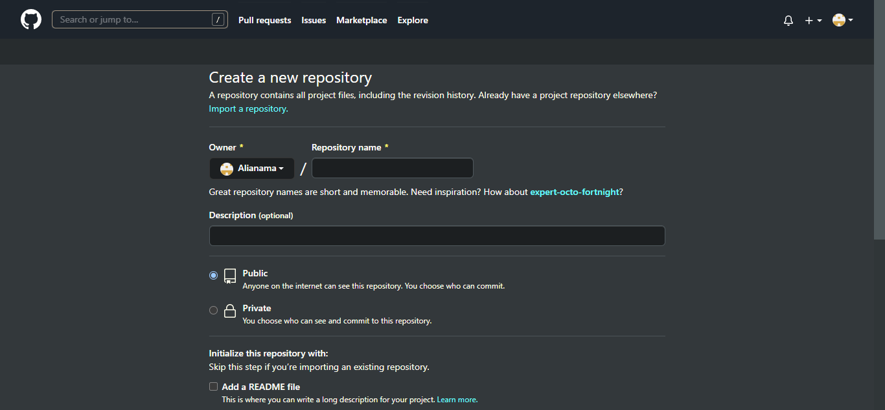
Jika sudah salin link repository yang telah dibuat
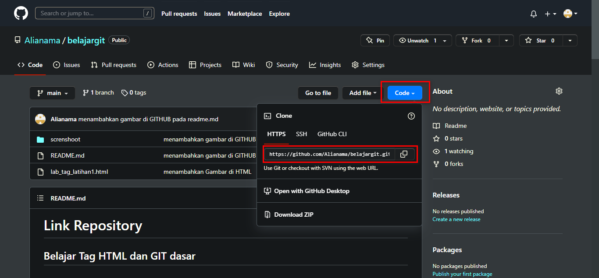
### Kedua download dan Install GIT Bash 
Download terlebih dahulu GIT Bash nya dir https://git-scm.com/downloads dan Install seperti Biasa
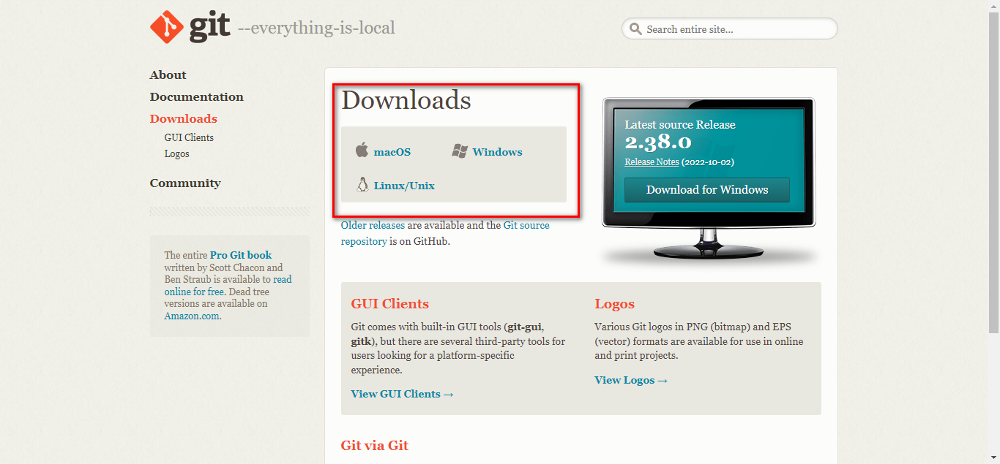
### Ketiga buat folder repository lokal pada komputer 
Buat folder repository lokal pada komputer seperti pada gambar 
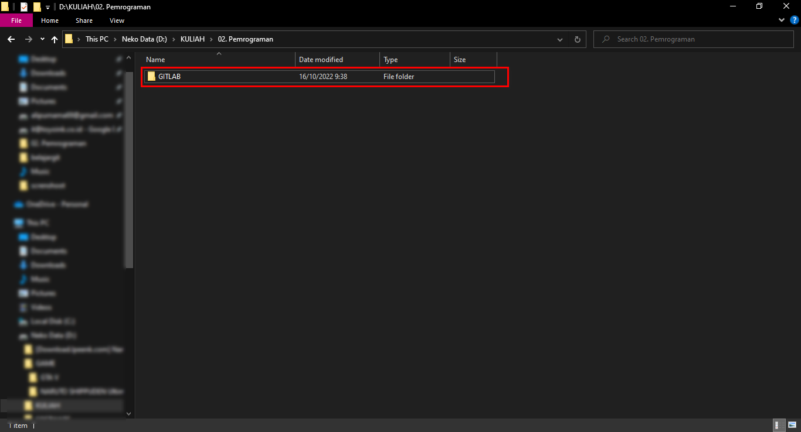
Lalu klik kanan pada folder tersebut dan pilih GIT Bash here
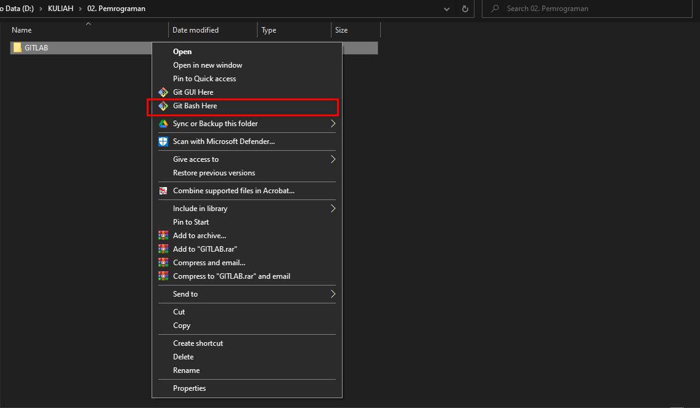
Untuk akses awal diharuskan daftar nama dan email dengan command "git config --global user.name “nama_user” dan git config --global user.email “nama_email”
Jika sudah lakukan clone repository github ke repository lokal dengan command git clone "URL YANG TELAH DI COPY TADI
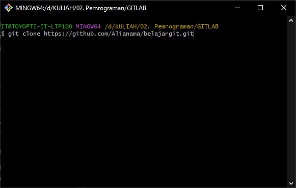 
Lalu masuk ke repository yang telah di clone dengan command cd "nama direktory" ada tanda (main/master) seperti pada gambar jika behasil masuk ke direktory
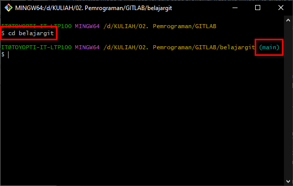
Maka kalian sudah berhasil koneksikan repository lokal dengan repository github
jika sudah ada perubahan pada repository lokal bisa di cek dengan command "git status" text yang berwarna merah adalah file yang mengalami perubahan atau penambahan 
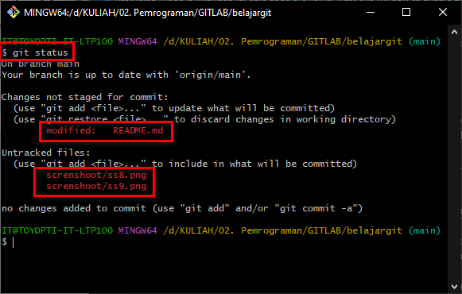 
jika sudah ada perubahan pada repository lokal dan ingin upload ke repository github dengan command "git add" untuk add file yang telah mengalami perubahan/penambahan
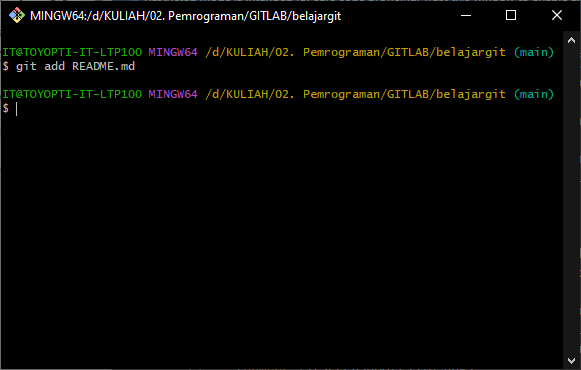 
jika sudah di add lakukan git commit untuk konfirmasi add dengan command "git commit -m "komentar perubahan"
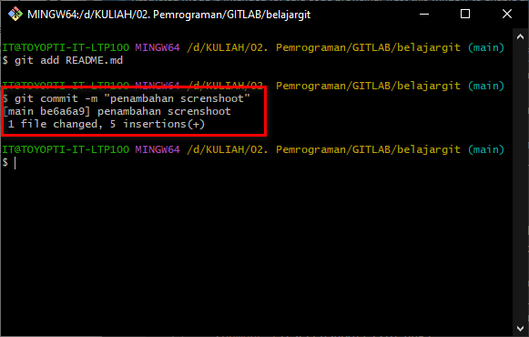 
lalu lakukan command "git push -u origin main/master" untuk upload ke repository github
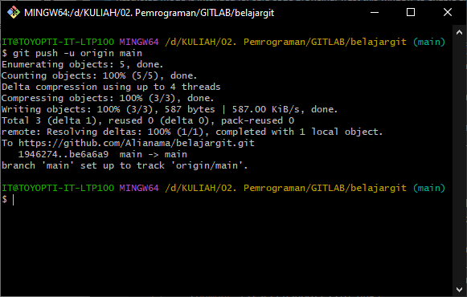 

## Maka file perubahan telah terupload pada repository github
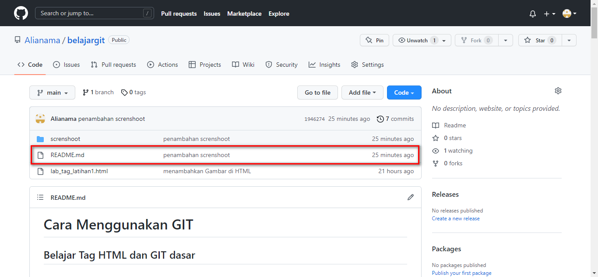 

#### Selesai

