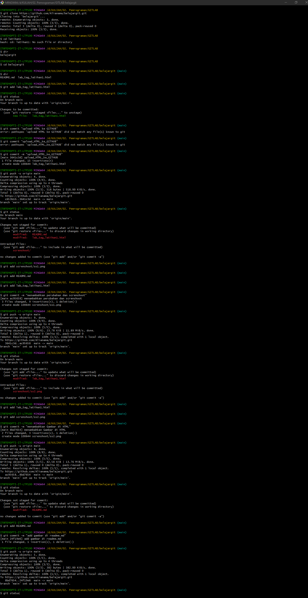

# Cara Menggunakan GIT
## Belajar Tag HTML dan GIT dasar

### Pertama Buat akun Github dan Buat repository baru
Buat akun github pada github.com lalu jika sudah buat Repository baru

Jika sudah salin link repository yang telah dibuat

### Kedua download dan Install GIT Bash 
Download terlebih dahulu GIT Bash nya dir https://git-scm.com/downloads dan Install seperti Biasa

### Ketiga buat folder repository lokal pada komputer 
Buat folder repository lokal pada komputer seperti pada gambar 

Lalu klik kanan pada folder tersebut dan pilih GIT Bash here

Screnshoot hasil

Command di GIT nya
